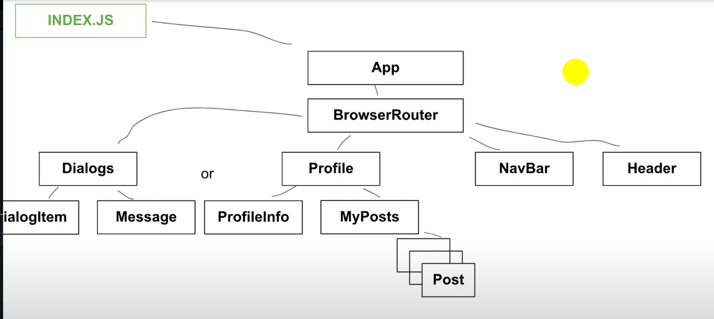
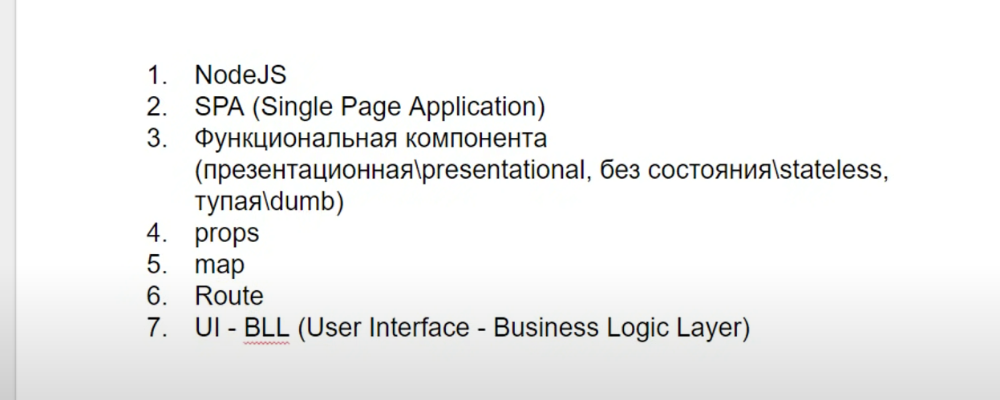
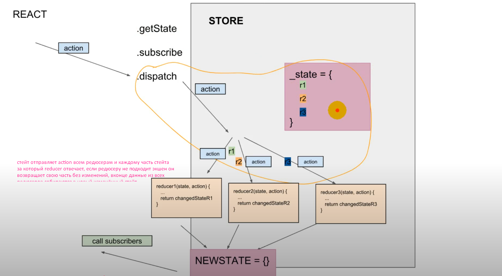
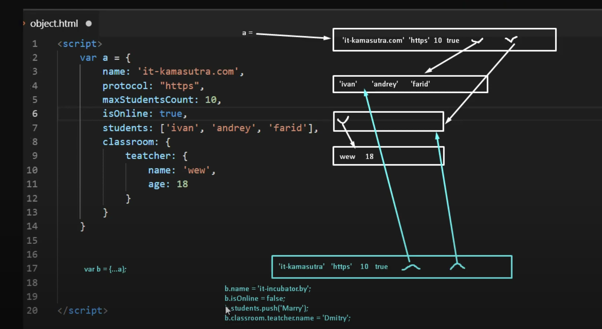

# sdfsdfasf
- sdfsdf 
*sdfsdf*  _sfsdf_
* sdfsdf [http://sdfsdf.com]


_                                                 __map()__

> map - это свойство массива которое всегда принимает стрелочную функцию (как и forEach/reduce)
```js
const newArray = oldArray.map((el) => {
	return isMaleName(el) ? 1 : 0;
})
```

***                                                      filter()**
```jsx
const onlineList = props.state.dialogsPage.dialogs.filter(dialog => dialog.online)
const onlineList = props.state.dialogsPage.dialogs.filter(dialog => dialog.online === true)
```

***                                                        push()**
> добавляет в конец массива новый элемент
```jsx
posts.push(newPost)
```


> если стрелочная функция имеет условие в 1 строку то можно воспользоваться неявным возвратом
```js
const newArray = oldArray.map((name) => isMaleName(name) ? : 0)
const newArray = oldArray.map(name => `<li> ${name} </li>`)
const newArray = oldArray.map(phrase => {
	return {
		eng: phrase,
		ru: translateRu(phrase)
	}
})
```
> если неявно вернуть нужно обьект то оборачиваем обьект в круглые скобки потому что 
> фигурные в стрелочной функции после стрелки означают тело функции
```js
const newArray = oldArray.map(phrase => ({eng: phrase, ru: translateRu(phrase)}))
```

***                                        структура проекта**
```js
                                            <App />

                                       <BrowserRouter />

                   <Routes />                      								<Navbar />   <Header />

    <Route path="/profile" element={<Profile />} />  or  ...
```


> road map для начала, необходимо знать



> копирует содержимое profilePage, тоесть копирует ссылку на содержание его обьекта и в 
> обьекте который принимает этот пропс при обращении к state будет доступ к его полям
```js
<Route path="/profile" element={<Profile state={props.state.profilePage} />} />
```


***                                                 callback функция**

> Callback функция — это функция, которая передается в другую функцию как аргумент и вызывается
>	в определенный момент, например, по завершении какой-либо операции или события.
<button onClick={ addPost } >Add post</button>

***                                     flux, solid, observer, publisher - какие ещё паттеры есть?**

> S. Принцип единственной ответственности(Single responsibility)
> O. Принцип открытости/закрытости (Open-closed)
> L. Принцип подстановки Барбары Лисков (Liskov substitution)
> I. Принцип разделения интерфейса (Interface segregation)
> D. Принцип инверсии зависимостей (Dependency Invertion)

***                                     reducer(state, action)**



***                                     npm install @reduxjs/toolkit**

> Redux Toolkit (RTK) — это библиотека, которая упрощает работу с Redux. Она включает:
> createSlice для создания редьюсеров и действий.
> configureStore для настройки хранилища.
> Встроенную поддержку Immer для работы с иммутабельными данными.
> Встроенную поддержку redux-thunk для асинхронных действий.
> И многое другое.


***                                     поверхностное и глубокое копирование**

> ...spred поверхностное копипование, копирует первый уровень вложености
```js
a = {
	name: 'it-kamasutra.com',
	protocol: 'https',
	maxStudentsCount: 10,
	isOnline: true,
	students: ['ivan', 'andrey', 'farid'],
	classroom: {
		teatcher: {
			name: 'wew',
			age: 18
		}
	}
}
b = {...a}

b.classroom.teatcher.name = 'Dmitry'
a.students === b.students

```
